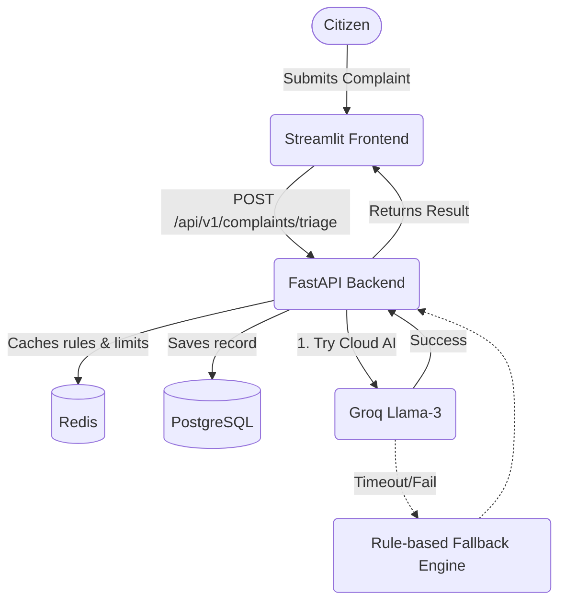

# CivicPulse 🏛️


## Problem Statement
Municipal departments receive thousands of complaints daily, from broken streetlights to water leaks. Manually reading, categorizing, and routing these complaints is slow, error-prone, and inefficient. **CivicPulse** is an AI-powered smart city complaint triage system that solves this by automatically categorizing, prioritizing, and routing citizen complaints to the correct departments in real-time, drastically reducing response times.

## 🏗️ Architecture



## 🚀 One-Command Quickstart

Start the entire system locally (Frontend, Backend, Postgres, Redis) using Docker Compose:

```bash
docker-compose up -d --build
```
- **Frontend UI:** http://localhost:8501
- **Backend API Docs:** http://localhost:8000/docs

## 🔌 API Table

| Endpoint | Method | Description | Request Body | Response |
|----------|--------|-------------|--------------|----------|
| `/health` | `GET` | System health check (DB, Redis) | None | `{ "status": "ok", "db": "up", "redis": "up" }` |
| `/api/v1/complaints/triage` | `POST` | Process & triage a complaint | `{ "text": "...", "location": "..." }` | `{ "category": "...", "priority": "...", "department": "..." }` |
| `/api/v1/monitoring/metrics`| `GET` | Get system metrics & triage stats | None | `{ "total_complaints": 150, "fallback_invocations": 2 }` |


